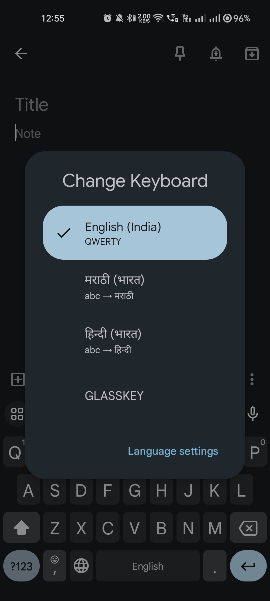
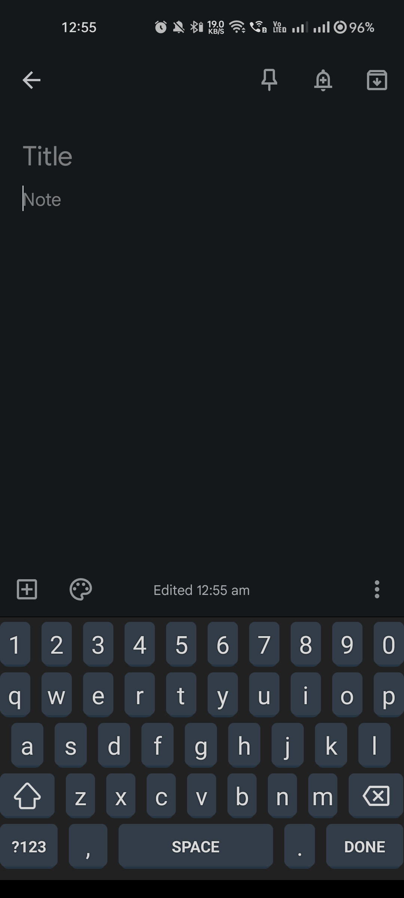
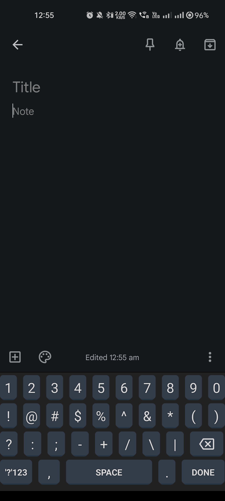

# Custom Keyboard

The Custom Keyboard is an Android application that provides a customizable keyboard experience. It allows users to personalize the keyboard layout, key labels, and behavior based on their preferences.

## Features

- Customizable key labels, positions, and sizes to suit individual needs.
- Support for multiple key variations, including special characters and numeric keypad.
- Seamless integration with any text input field in Android applications.
- Sound effects for keypress feedback.
- Smooth and responsive typing experience.

## Screenshots

<br/>
<br/>



## Getting Started

### Prerequisites

- Android Studio installed on your machine.
- An Android device or emulator running Android OS.

### Installation

1. Clone the repository to your local machine.

```bash
git clone https://github.com/your-username/custom-keyboard.git
```
1. Open the project in Android Studio.
2. Build and run the project on your Android device or emulator.

### Usage

1. Go to your device's Settings and navigate to Language & Input.
2. Select Virtual Keyboard or Keyboard & Input Methods.
3. Enable the Custom Keyboard option and grant necessary permissions.
4. Open any app with a text input field (e.g., messaging app, email client).
5. Long-press the text input field to bring up the keyboard selection dialog.
6. Choose Custom Keyboard from the available keyboards.
7. The custom keyboard will appear, and you can start typing using the personalized layout and key labels.


### Customization

The Custom Keyboard provides various customization options to tailor the keyboard to your preferences. Here are the key files to modify:

- **keyboard.xml**: XML layout file defining the keyboard's appearance and key layout.
- **qwerty.xml**: XML file defining the key labels and layout for the QWERTY keyboard.
- **keyboard_special_chars.xml**: XML file defining the key labels and layout for the special characters keyboard.

Feel free to modify these files to change key labels, positions, colors, sizes, and other properties to match your desired keyboard design.

### License

The Custom Keyboard project is licensed under the MIT License. You are free to modify and distribute the code for personal and commercial use.

